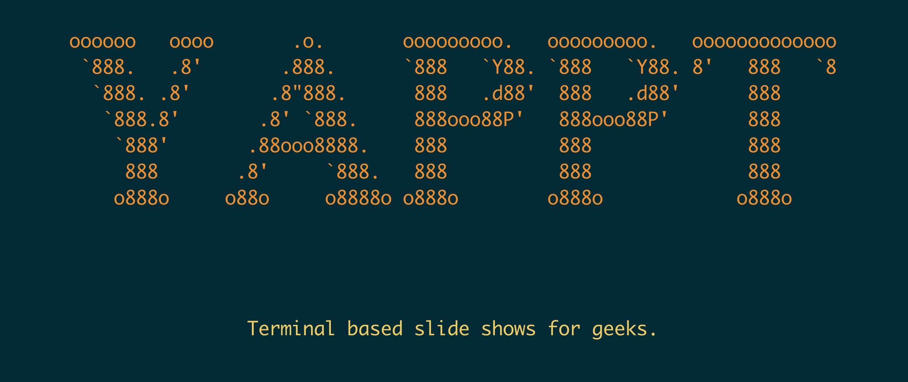

<h1>YAPPT </h1>

*Yet Another Powerpoint Tool*

*YAPPT Ain't Powerpoint*

**Terminal-based slide shows for geeks**

YAPPT is quite literally, *yet* another one of those tools that, for some reason, geeks and coders think is a good way of presenting stuff to fellow geeks.

## Why? Surely this has been done to death...

Well, yes... It has... But not like this! And, in keeping with true coder values, if there isn't one around that does what you want, then build your own. Here it is in action:

## What's so special about this one, then?

Here's a list of features:

* supports slide layouts reasonably well, with the ability to split the screen up into cells and drop bits of content into these cells in a sane way, which aligns stuff well -- this was the feature I wanted but couldn't find in other tools.
* supports figlet fonts natively, because true geeks **need** figlet support
* markdown support is built in (but code-based syntax highlighting is still a to-do)
* all the colors your terminal supports
* emojis and unicode as standard 🤘🏼
* left, centre and right justifying text blocks
* dynamically redraw the slide if the terminal's dimensions changes
* reload the input file to the slide you're on without restarting
* slide by slide, or cell by cell transitions
* input is a simple YAML file

## Installation

`pip install yappt`

## Requirements (and config that works for me):

* Python 3.7 (yes, I've not tested it on anything older, but it works with this. It'll probably work with most other Python3s)
* `TERM=xterm-256color`
* curses/ncurses

## Input

Input is YAML. See [INPUT.md](INPUT.md) for details.

## Issues and outstanding tasks

There are a few...

### Test coverage
Right now, it's pretty much non-existant. I knocked this up for my own use and it works for me. I may add some tests when time/inclination permits, but for now, it is what it is.

I've tested it only on MacOS running under iTerm2. YMMV if you try it under another terminal client or setup. Let me know if this is an issue.

### Todo

* syntax highlighting code blocks
* template support (i.e., set the template for all slides and then inherit)
* including multiple YAML files
* er... tests...
* tox

## Contributions...

...are welcome. Fork, tweak, PR... etc

## Licence

[MIT](LICENSE)

## Credits

* cli library: [click](https://click.palletsprojects.com/en/7.x/)
* YAML library: [ruamel-yaml](https://yaml.readthedocs.io/en/latest/)
* figlet library: [pyfiglet](https://github.com/pwaller/pyfiglet)
* markdown library: [mistletoe](https://github.com/miyuchina/mistletoe)
